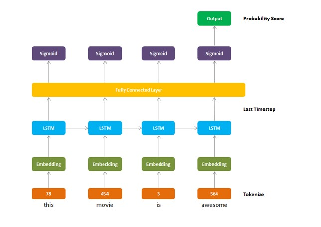

## Hello

👋 Hi, my name is Andy, come from Taiwan, with 2 years working experience as a data analyst

👀 I’m interested in Data Analytics and Data Science opportunities in the United States

🌱 I’m currently a Master Student major in Analytics at University of Southern California

💞️ I’m a highly responsible person who is also cooperative, meticulous, and innovative. Always eager to learn new things with considerable passion and curiosity. Based on my study and experiences in Data Analytics, I look forward to exploring more and applying what I have learned to business. No matter facing any challenges, I will be well prepared, adapt to new changes, and tackle them with an optimistic attitude.

📫 How to reach me: Email: wuchungm@usc.edu ; Linkedin: www.linkedin.com/in/chungmingwu

## Text Classification with NLP in MLP, CNN, and RNN Model

This is the Final Project at USC.

### First, in Data Exploration and Pre-processing, use Word Embeddings with Keras Tensorflow (Tokenize) in 2000 dataset, which include 1000 positive reviews, and 1000 negative reviews. Then, using different model with the Data Set.

1. Multi-Layer Perceptron (MLP)
2. One-Dimensional Convolutional Neural Network (CNN)
3. Long Short-Term Memory Recurrent Neural Network (RNN)

## Tokenize Model

## MLP

## CNN

## RNN

## Machine Learning for Data Science

